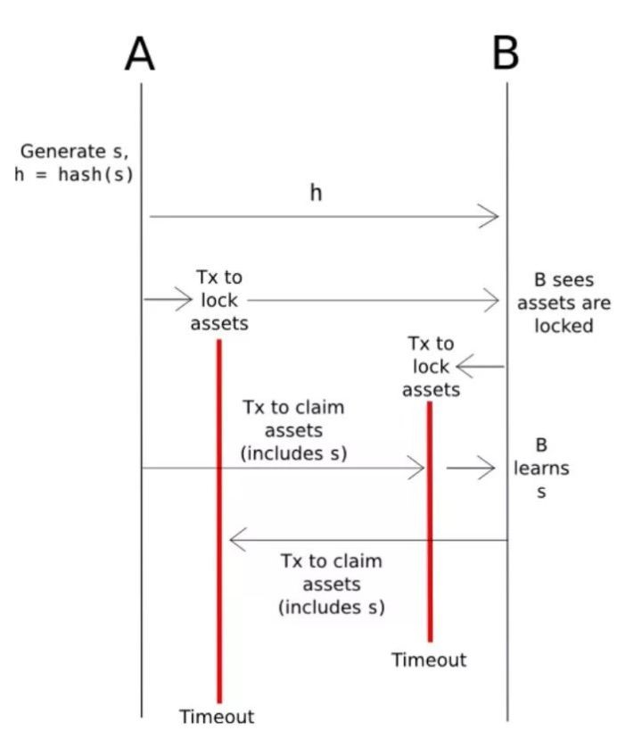
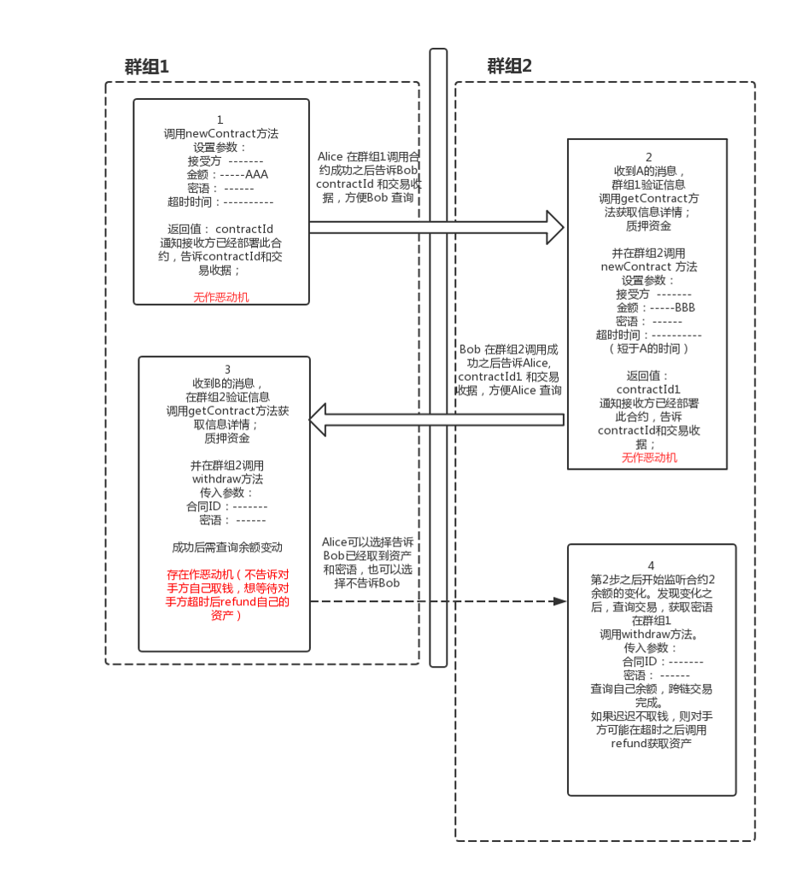

# BAC资产管理服务
## 简介
此服务是BAC的资产管理工具，目前主要有资产管理和跨链交易两个功能；

- *资产管理*：
资产管理可以管理跨群组资产，支持添加资产，输入合约地址和群组ID，即可显示自己的余额。并支持转账。

- *跨链交易*：
跨链交易是基于哈希时间锁实现的。哈希锁定通过时间差和隐藏哈希值来实现资产的原子交换。
哈希时间锁的结构如图1所示： 
 交互流程如图所示： 
 如交互流程图所示：以BAC001跨链互换为例，其他场景可类比；  
 前提条件：
 假设群组1和群组2存在，均存在Alice 和Bob账户，群组1和群组2均部署哈希锁定合约，分别为哈希锁定合约1，哈希锁定合约2。并各自署BAC001的资产AAA，BAC001的资产BBB。
   1. 群组1中： Alice 设置超时时间，并产生一段密语，密语hash后调用 哈希锁定合约1的newContract函数。 并批准哈希锁定合约1可以调用Alice的AAA 100个,获取合约id之后告知Bob合约id。
   2. Bob 看到Alice调用了群组1的newContract函数， 在群组2中，Bob也调用哈希锁定合约2的newContract函数，哈希锁即是Alice的密语hash. 并批准哈希锁定合约2可以转Bob的500个BBB，也设置超时时间，时间要短于Alice设置的超时时间。
   3. Alice看到Bob根据自己密语调用了newContract函数，则去群组2 调用哈希锁定合约2的withdraw函数。取出500BBB。
   4. Alice调用withdraw函数会泄露传入自己的密语，Bob知道密语则去链1调用哈希锁定合约1的withdraw函数取回100个AAA。 跨链交换100AAA 和500BBB完成。
   5. 如果对方超时未处理，则取回自己存在哈希锁定合约的资产。

## 用户手册：
1. 打开资产管理服务，先在资产管理添加要进行跨链交易的资产；如群组1的AAA和 群组2的BBB，添加成功后会显示资产余额；
2. 进入跨链资产交易界面：选择发起方或者接收方。无论接收方和发起方，交易步骤都是3步；**存入资产**，**取出对方资产**，以及**超时取回自己资产**；
3. **存入资产**  
   发起方输入 接受者，密文，转出的资产（自己的待交换资产） 和转入资产（对手方的资产）数量；并选择过期时间，默认发起方是3小时，点击提交会返回合同ID，并告知接收方； 
   
   如果是接收方的话需输入发起方的合同ID， 由发起方线下告诉接收方，成功提交后会返回另外一个合约id(接收方合约id)，接收方需要把接收方的合约id也告诉发起方
4. **取回资产**  
   发起方输入 接收方合约id， 并输入自己第一步设置的密语，取回资产。 
    
   接收方收到发起方取回资产的通知，获得了密语，也会输入发起方的合约id和密语，取回发起方的资产。交易完成。
5. **超时取回** 
    存入资产无论发起方还是接收方都会设置超时时间，如果超时时间过了。可以取回自己存入合约的资产。                     


## 安装说明
  
  使用方式跟WeBASE-Front服务类似，服务启动后 输入{ip}：5002即可进入界面。
## 1. 拉取代码
执行命令：
```
git clone git@git.weoa.com:ttip/bac-trade.git
```

进入目录：

```
cd bac-trade
```

## 2. 编译代码

执行构建命令：

```
chmod +x ./gradlew
./gradlew build -x test
```

构建完成后，会在根目录下生成已编译的代码目录dist。

## 3. 修改配置

（1）进入dist目录

```
cd dist
```

（2）进入conf目录：

```shell
cd conf
```

**注意：** 需要将节点所在目录`nodes/${ip}/sdk`下的`ca.crt`、`node.crt`和`node.key`文件拷贝到当前conf目录，供SDK与节点建立连接时使用。

（3）修改配置（根据实际情况修改）：

```
vi application.yml
```

``` 
spring:
  datasource:
    url: jdbc:h2:file:./h2/webasefront;DB_CLOSE_ON_EXIT=FALSE // 默认H2库为webasefront
...
server: 
  port: 5003                    // 服务端口
  context-path: /
sdk: 
  ...
  ip: 127.0.0.1                 // 连接节点的监听ip
  channelPort: 20200            // 连接节点的链上链下端口
```

## 4. 服务启停

返回到dist目录执行：
```shell
启动: bash start.sh
停止: bash stop.sh
检查: bash status.sh
```
**备注**：如果脚本执行错误，尝试以下命令:

```
赋权限：chmod + *.sh
转格式：dos2unix *.sh
```

## 5. 访问控制台

```
http://{deployIP}:{frontPort}
示例：http://localhost:5002/
```
